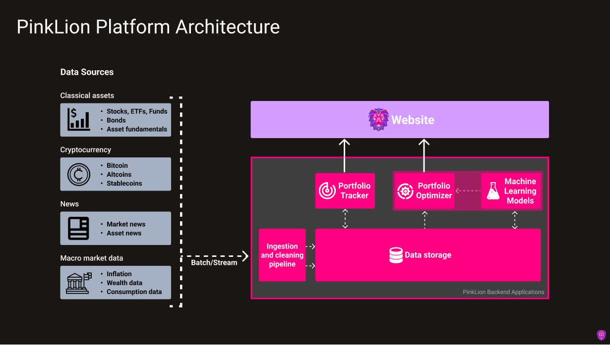

---
hide:
  - navigation
  - toc

description: Technical documentation of PinkLion. Learn how the PinkLion Platform applies data science and machine learning to delivery world class intuitve portfolio management and asset allocations.
---

# **Documention - Transparency is key**
Technical documentation of PinkLion. Learn how the PinkLion Platform applies data science and machine learning to delivery intuitve world class portfolio management and asset allocations.

## **Overview**

PinkLion has been built to help people make better investment decision by combining world class portfolio management and simple, intuitve design.  
The bedrock of PinkLion are a multitude of mathematically complex models that allow best in class scientific portfolio management and strategic asset allocations. Users can gain insights of how risk can be optimally structured and lowered, as well as how more stable and increased asset returns can be achieved. 

!!! Example "Guidance"
    **Factual clarity is an integral part when making financial decision.**

    Thus we try our best to provide a detailed documentation for every single component that is part of the PinkLion Platform. In addition, we provide a in-depth explaination of how each platform component works and functions.

Below find links to resources and the technical documentation.

---

## **Platform architecture**
### Explore PinkLion's, API-first platform architecture

The PinkLion Platform is a micro-service architecture with multiple services. 

The PinkLion Platform centralizes and standardizes financial data from many different sources. Which enables the user to apply data science and machine learning via the PinkLion web interface to dramatically improve the understanding of how markets behave and what risks and returns are associated to individual assets.

[Learn more](platform-architecture/) about each service and the capability it provides.

<figure markdown>
  
  <figcaption>High-level platform architecture and applications comprising PinkLion</figcaption>
</figure>

---

## **Portfolio Optimizer**
### Explore the Functionalities of PinkLion's Portfolio Optimizer
The PinkLion Portfolio Otimizer is the heart of the platform and is responsible for derving asset insights and determining portfolio allocations. 

It incorporates multiple micro-services which include classical mean-variance optimization techniques, Black Litterman allocations, and proprietary machine learning models that predict the future performance and risk level of specific assets.

[Learn more](portfolio-optimizer/) about the capability it provides.

<figure markdown>
  
  <figcaption>High-level portfolio optimizer architecture of PinkLion</figcaption>
</figure>
