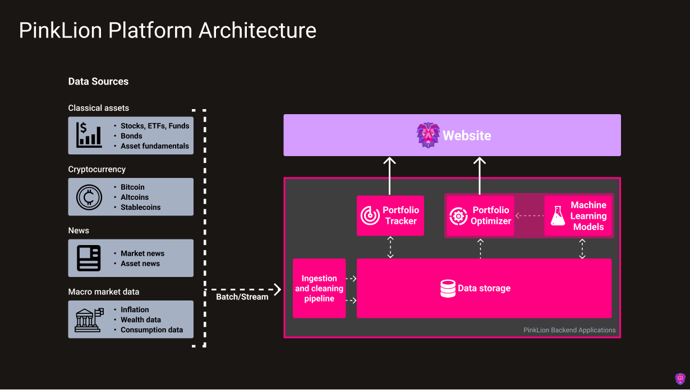
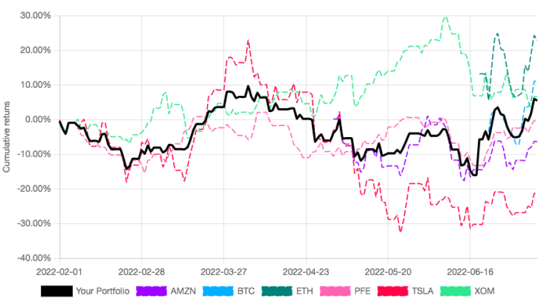
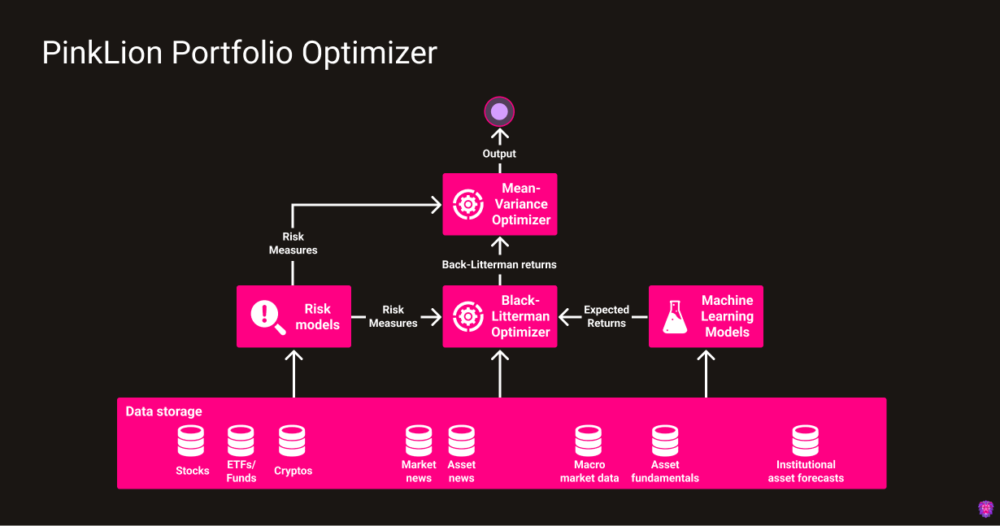

---
hide:
  - navigation

title: 
description: Technical documentation of the PinkLion Platform Architecture. Learn how the PinkLion Platform applies data science and machine learning to delivery world class intuitve portfolio management and asset allocations.
---

# **Platform architecture**

The PinkLion Platform is a micro-service architecture with multiple components. The platform centralizes and standardizes financial data from many different sources. The connected sources include classical asset information of stocks, ETFs, and funds as well as various cryptocurrencies. News article for general market activities and specific asset news and events are being collected in conjunction with macroeconomic market data.

The curated data corpus enables you as the user to apply data science and machine learning via the PinkLion web interface to dramatically improve the understanding of how markets behave and what risks and returns are associated to individual assets.

<figure markdown>
  
  <figcaption>High-level platform architecture and applications comprising PinkLion</figcaption>
</figure>

---

## **Data Sources** 
The connected data sources represent the fundamental layer of the PinkLion Platform. An overview of each can be found in the table below.

| Data source name        | Description                          |
| -----------------| ------------------------------------ |
| Classical Assets | Classical Assets are Stocks, ETFs, and Funds for which `Asset prices`, `Trading volumes`, `Dividends` and many more attributes are being recorded.   In addition, asset fundamentals including `Company Balance Sheets`, `Company Profit & Loss Statements`, and `ESG information` are being collected.|
| Cryptocurrencies | The data source Cryptocurrencies is comprised of Bitcoin, various Altcoins and Stablecoins for which `Asset prices`, `Trading volumes`, `Coin supply`, `Market shares` and many more attributes are being recorded. |
| News             | The PinkLion Platform collects for the News data source news articles from multiple sources to obtain an early market sentiment. Thus, for a better understanding of why markets are moving and why specific assets are having price shifts is obtained. For a holistic picture `Market news` and specific `Asset news` are being index and aggregated|
| Macroeconomic market data | In order to capture long lasting trends in the market high-level market data are being collected which include `Inflation`, `Citizen Wealth Developments`, and `Consumption rates`, ... |

---

## **Data Ingestion and Storage**
After having identified relevant data sources an infrastructure ingests, cleans, and categories the incoming data. Each source is ingested either via a scheduled batch or a streaming pipeline and goes through multiple cleaning steps to ensure that all ingested records are unique, posses the same granularity and indices.

Since portfolio management and strategic asset allocation which is made available via the web interface, two very polar opposite data availability requirements are imposed on the PinkLion storage infrastructure. 

You as a user should always have the most up to date information at hand when interacting with the PinkLion website. On the other hand very complex and data heavy algorithmic and machine learning applications have to generate additional insights which will give you an edge when making a decision.

Due to the need of having data available in almost real-time for the website and having massive amounts of data at hand for the insight generating machine learning models, the PinkLion storage infrastructure is split in two parts. 

**Part one of the storage infrastructure** is responsible for making a selected set of information timely available to you as the user and is able to receive many small updates with a limited historical scope.

**Part two of the storage infrastructe** is a more persistent storage which holds the entire data corpus of the PinkLion Platform. It is used by various machine learning micro-service applications to generate insights which are being served to the website.

!!! Tip "Storage infrasture capability"
    Combined the PinkLion Storage infrastructure is able to provide a real-time view of a portfolio and assets as well as insights which have been derived by considering the entire history of a large portion of the market.

---

## **Portfolio Tracker**
The PinkLion Portfolio Tracker allows to keep track of your portfolio developments. It provides a historical view of your portfolio performance, how much captial has been invested and important KPIs. 

In addtion, portfolio metrics are being calculated such as annulaized returns, maximal drawdowns and the sharpe ratio of the portfolio.
The Portfolio Tracker is able to access data of around **8000 Stocks**, **2000 Funds and ETFs**, and over **7500 Cryptocurrencies**.

No complicated setup or data maintenance is required, your investments can be entered into the tracker and are instantly visualized.

<figure markdown>
  
  <figcaption>PinkLion Portfolio Tracker Chart</figcaption>
</figure>

Weight charts across all asset classes let you see at a glance your capital allocation across sectors, asset classes and countries to identify cluster risks. (to be released)

!!! Tip "Optimizing your portfolio"
    In order to improve the returns of your porfolio or to use a scientific risk management, your portfolio can be simply handed over to the PinkLion Portfolio Optimizer.

---

## **Portfolio Optimizer**
The PinkLion Portfolio Optimizer is the heart of the platform and is responsible for derving asset insights and determining portfolio allocations.
The Optimizer is fully integrated and consists of multiple sub-components of which all are having access to the underlying data corupus. The entire might of the PinkLion Portfolio Optimizer can be used with single press on a button. 

From a high-level architectural perspective the Optimizer is comprised of various risk models, machine learning models to predict future asset performance, and a multitude of models that determine potential portfolio allocations. To find out more go to the **Portfolio Optimizer** section.

<figure markdown>
  
  <figcaption>High-level portfolio optimizer architecture of PinkLion</figcaption>
</figure>

