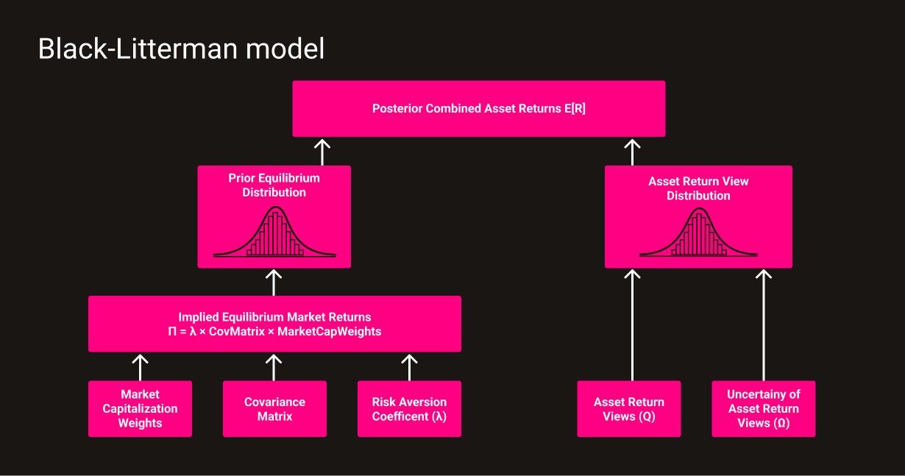

---
hide:
  - navigation

title: 
description: Technical documentation of the PinkLion Portfolio Optimizer. Learn how the PinkLion Portfolio Optimizer can be used for risk reduction, return improvements and tactical asset allocation.
---

# **Portfolio Optimizer**

The PinkLion Portfolio Optimizer is the heart of the platform and is responsible for derving asset insights and determining portfolio allocations. 
It incorporates multiple micro-services which include classical mean-variance optimization techniques, Black Litterman allocations, and proprietary machine learning models that predict the future performance and risk level of specific assets.

<figure markdown>
  
  <figcaption>High-level portfolio optimizer architecture of PinkLion</figcaption>
</figure>

---

## **Black-Litterman Optimizer**
The Black-Litterman Optimizer uses the Black-Litterman model, created by Fischer Black and Robert Litterman. It is a sophisticated portfolio construction method that overcomes the problem of **unintuitive**, **highly-concentrated portfolios**, **input-sensitivity**, and **estimation error maximization**, which are known short-comings of the mean-variance optimization developed by Markowitz. Within the PinkLion Portfolio Optimizer, the Black-Litterman model is used to generate stable expected returns which are passed to a Mean-Variance Optimizer where the returns are paired with different risk predictions and measures to calculate a robust portfolio. 

The Black-Litterman model uses a Bayesian approach to combine the subjective views of a prediction model regarding the expected returns of one or more assets with the market equilibrium vector of expected returns to form a new, mixed estimate of expected returns.

### **Expected returns**
The Black-Litterman model creates stable returns, based on a prediction model's unique insights, which overcome the problem of input-sensitivity.
An additional feature of the Black-Litterman model that improves the stability of the predicted returns is to largely mitigate the problem of estimation error-maximization by spreading the errors throughout the vector of expected returns. 

The Black-Litterman returns are essential when generating stable, mean-variance efficient portfolios. In contrast, classical expected return predictions which are based on historical asset returns, equal mean returns or risk-adjusted equal mean returns, lead to extreme portfolios.
Extreme portfolio describe **portfolios with large long and short positions** when no constraints apply, and **portfolios with a small number of assets** if a long only asset position constraint is applied.

### **Reverse optimization**
The Black-Litterman model uses equilibrium returns as a neutral starting point. Equilibrium returns are the set of returns that clear the market. The equilibrium returns are derived using a reverse optimization method in which the vector of implied excess equilibrium returns is extracted from known information using the following Formula.

$$
\operatornameΠ=λ * CovMatrix * MarketCapWeights
$$

where

- $\operatornameΠ$ is the Implied Excess Equilibrium return vector
- $λ$ is the risk aversion coefficient, which represents the rate at which an investor will forego expected return for less variance
- $CovMatrix$ is the covariance matrix of excess returns (N x N matrix)
- $MarketCapWeights$ is the market capitalization weight vector (N x 1) of the assets

In the reverse optimization process, the risk aversion coefficient $λ$ acts as a scaling factor for the reverse optimization estimate of excess returns. The weighted reverse optimized excess returns equal the specified market risk premium. More excess return per unit of risk (a larger lambda) increases the estimated excess returns.

### **Investor views**
The Black-Litterman model allows adding an investor's target return view of an asset which is within the PinkLion Portfolio Optimizer generated by multiple machine learning models. The target return views of an asset can be provided either as an absolute view or as a relative view with a confidence level. It is not necessary to provide target return views for every asset.

The target return views are expressed as the vector $Q$ and a the uncertainty of each view is captured with the vector $Ω$.

### **Black-Litterman model**

Conceptually, the Black-Litterman model is a complex, weighted average of the
Implied Equilibrium Market Return Vector $\operatornameΠ$ and the View Vector $Q$, in which the relative
weightings are a function of the scalar $τ$ and the uncertainty of the views $Ω$.
The greater the level of confidence (certainty) in the expressed views, the closer the new return vector will be to the views. 

If the prediction model is less confident in the expressed views, the new return vector should be
closer to the Implied Equilibrium Market Return Vector $\operatornameΠ$.

!!! Tip "Black-Litterman output"
    The Black-Litterman model is meant to produce a vector of asset returns $E[R]$ which are influenced by the views of a prediction model. 

The formula for deriving the asset returns looks as follow:

$$
\operatorname E[R] = [(τΣ)^{-1} + PΩ^{-1}P] × [(τΣ)^{-1}\operatornameΠ + PΩ^{-1}Q]
$$

where

- $E[R]$ is the new (posterior) Combined Return Vector (N x 1 column vector)
- $τ$ is a scalar that is inversely proportional to the relative weight given to the Implied Equilibrium Market Return Vector $\operatornameΠ$
- $Σ$ is the covariance matrix of excess returns (N x N matrix)
- $P$ is a matrix that identifies the assets involved in the views (K x N matrix or 1 x N row vector in the special case of 1 view)
    * **K** is the number of views
    * **N** is the number of assets
- $Ω$ is a diagonal covariance matrix of error terms from the expressed views representing the uncertainty in each view (K x K matrix)
- $Q$ is the View Vector (K x 1 column vector). 
- $\operatornameΠ$ is the Implied Equilibrium Market Return Vector (N x 1 column vector)

For a better overview here is a diagram of the calculation steps within the Black-Litterman model.

<figure markdown>
  
  <figcaption>Black-Litterman model calculation steps</figcaption>
</figure>

The scalar $τ$ is more or less inversely proportional to the relative weight given to the Implied Equilibrium Market Return Vector $\operatornameΠ$. 
Unfortunately, guidance in the literature for setting the scalar’s value is scarce. Both Black and Litterman (1992) and Lee (2000) address this issue, since the uncertainty in the mean is less than the uncertainty in the return, the scalar $τ$ is close to zero.

The model does not require an target return view for every single asset, instead a single view can cause the return of every asset in the
portfolio to change from its Implied Equilibrium Market return, since each individual return is linked to the other returns via the covariance matrix of excess returns $\operatornameΣ$.

Source: A STEP-BY-STEP GUIDE TO THE BLACK-LITTERMAN MODEL - Thomas M. Idzorek

---

## **Risk models**

Within the PinkLion Portfolio Optimizer the following metrics are being used to determine the risk of an asset and portfolio. The metrics are used 

|Risk Measure|Description|Risk-Return Measure|
|------------|-----------|---------------------------|
|Standard Deviation|The standard deviation indicates how much the data deviates and will fall within a certain distance from the mean.|Sharpe Ratio|
|First Lower Partial Moment|Lower Partial Moments measure risk by considering only negative deviations from a reference point. The first moment describes the expected shortfall as an area between the target level and negative asset returns.|Omega Ratio|
|Second Lower Partial Moment|Lower Partial Moments measure risk by considering only negative deviations from a reference point. The second moment describes the expected variance between the target level and negative asset returns.|Sortino Ratio|
|Maximum Drawdown|The Maximum Drawdown represents the maximum cumulative loss of a portfolio or asset from the highest price within a period, and is usually displayed as a percentage.|Calmar Ratio|
|Value at Risk (VaR)|The value at risk describes the maximum expected loss in value of a portfolio that is unlikely to be exceeded within a holding period under normal market conditions.||
|Conditional Value at Risk (CVaR)|The conditional value at risk (CVaR) is the average expected loss with the condition that the Value at Risk (VaR) is exceeded. Like the VaR, it is a measure of the downside risk, but not only takes into account the probability of a loss, but also its magnitude. The CVaR is particularly suitable to measure extreme level of risks, which are very unlikely to occur but cause massive financial damage.||

---
<!-- 
## **Machine Learning models**

--- -->

## **Mean-Variance Optimizer**

A pioneering theory of portfolio management is the Markowitz model (1952), also known as the mean-variance approach or modern portfolio theory (MPT). The theory is based on the premise that when allocating resources among different assets, the investor considers not only the expected returns but also the risk associated with each of these holdings. Modern portfolio theory assumes that the investor maximizes the expected utility of a portfolio.

The Mean-Variance Optimizer implementation within the PinkLion Optimizer takes the expected asset returns generated by the Black-Litterman model and evaluates them against one or multiple risk metrics which have been defined above.

Therefore, a set of asset allocations is defined, made available on the PinkLion web interface and delivered to you as the user.

---